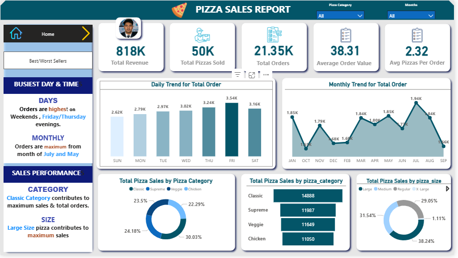
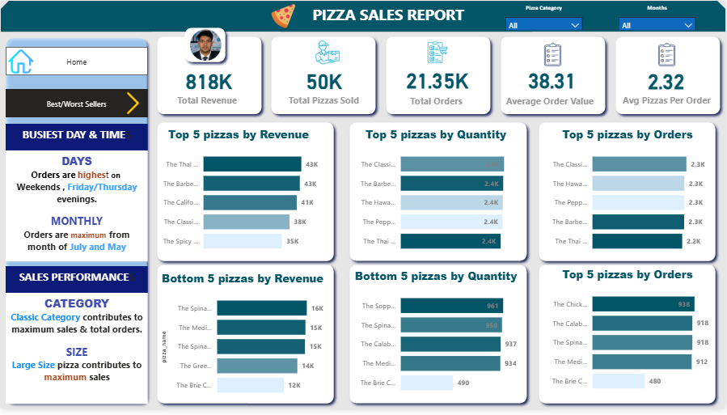

# 🍕 Pizza Sales Dashboard using SQL & Power BI 
[](https://opensource.org/licenses/MIT)
[](https://www.microsoft.com/en-us/sql-server)
[](https://powerbi.microsoft.com/)


Welcome to my Pizza Sales Analysis project!  
This dashboard helps visualize key insights from pizza sales data using **Microsoft SQL Server** for data preparation and **Power BI** for reporting.

--- 

## 📊 Dashboard Highlights

- **Total Revenue**: 818K+
- **Total Pizzas Sold**: 50K+
- **Total Orders**: 21.35K+
- **Average Order Value (AOV)**: 38.31
- **Average Pizzas per Order**: 2.32

---

## 💡 Key Business Insights

- **Best Days**: Friday & Thursday evenings have the highest orders.
- **Best Months**: July and May show peak performance.
- **Top Category**: Classic pizzas dominate both in revenue and sales.
- **Top Size**: Large pizzas bring the highest revenue.

---

## 📊 Dashboard Preview

### 🔹 Main Dashboard


### 🔹 Best/Worst Sellers


---

## 🛠️ Tools & Technologies

| Tool | Icon | Purpose |
|:----:|:----:|---------|
| SQL Server |  | Data cleaning & analysis |
| Power BI |  | Data visualization |
| CSV Dataset |  | Pizza sales data |

---

## 🧮 SQL Queries Used for Analysis

```sql
-- Total Revenue
SELECT SUM(total_price) as Total_Revenue FROM pizza_sales;

-- Average Order Value
SELECT SUM(total_price) / COUNT(DISTINCT order_id) AS Avg_Order_Value FROM pizza_sales;

-- Total Pizzas Sold
SELECT SUM(quantity) as Total_Pizza_Sold FROM pizza_sales;

-- Total Orders
SELECT COUNT(DISTINCT order_id) AS Total_orders FROM pizza_sales;

-- Average Pizzas Per Order
SELECT CAST(CAST(SUM(quantity) AS DECIMAL(10,2)) / 
            CAST(COUNT(DISTINCT order_id) AS DECIMAL(10,2)) 
       AS DECIMAL(10,2)) AS Avg_Pizza_per_order 
FROM pizza_sales;

-- Daily Trend for Total Orders
SELECT DATENAME(DW, order_date) AS order_day, 
       COUNT(DISTINCT order_id) AS Total_orders 
FROM pizza_sales 
GROUP BY DATENAME(DW, order_date);

-- Monthly Trend for Total Orders
SELECT DATENAME(MONTH, order_date) AS Month_Name, 
       COUNT(DISTINCT order_id) AS Total_orders 
FROM pizza_sales 
GROUP BY DATENAME(MONTH, order_date) 
ORDER BY Total_orders DESC;

-- Sales by Pizza Category (for January)
SELECT pizza_category, 
       SUM(total_price) AS Total_sales, 
       SUM(total_price) * 100 / (SELECT SUM(total_price) FROM pizza_sales) AS Percentages_Of_Sales 
FROM pizza_sales 
WHERE MONTH(order_date) = 1 
GROUP BY pizza_category;

-- Sales by Pizza Size (for January)
SELECT pizza_size, 
       SUM(total_price) AS Total_sales, 
       SUM(total_price) * 100 / (SELECT SUM(total_price) FROM pizza_sales) AS Percentages_Of_Sales 
FROM pizza_sales 
WHERE MONTH(order_date) = 1 
GROUP BY pizza_size;

-- Total Revenue by Pizza Name
SELECT pizza_name, 
       SUM(total_price) AS Total_Revenue 
FROM pizza_sales 
GROUP BY pizza_name 
ORDER BY Total_Revenue DESC;

-- Top 5 Pizzas by Revenue
SELECT TOP 5 pizza_name, 
       SUM(total_price) AS Total_Revenue 
FROM pizza_sales 
GROUP BY pizza_name 
ORDER BY Total_Revenue DESC;

-- Top 5 Pizzas by Quantity Sold
SELECT TOP 5 pizza_name, 
       SUM(quantity) AS Total_Quantity 
FROM pizza_sales 
GROUP BY pizza_name 
ORDER BY Total_Quantity DESC;
